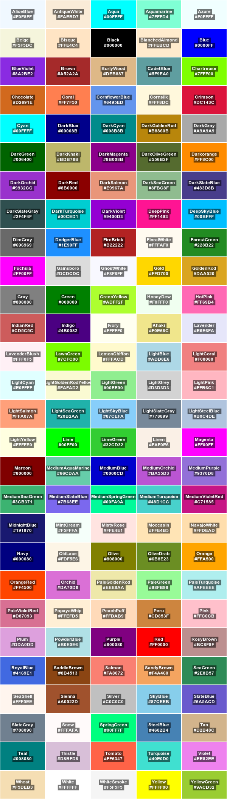

# Montage of named colours in FFmpeg Utilities

[FFmpeg Utilities](https://ffmpeg.org/ffmpeg-utils.html) shows a [Color](https://ffmpeg.org/ffmpeg-utils.html#Color) Syntax section with 140 standard X11 colour names.
What’s lacking is any visual colour rendering, forcing you to search elsewhere.
Wikipedia shows a [Color name chart](https://en.wikipedia.org/wiki/X11_color_names#Color_name_chart) of standardized X11 color names from the X&#46;org source code but there are 145 colours there.
So below are two montages generated directly from  ffmpeg’s [libavutil/parseutils.c](https://github.com/FFmpeg/FFmpeg/blob/master/libavutil/parseutils.c) `color_table[]` array RGB values, sorted by Name and HSV respectively.
They were generated by the Bash script [ffmpeg-colours.sh](ffmpeg-colours.sh).

## Ordered by Name

## Ordered by HSV

